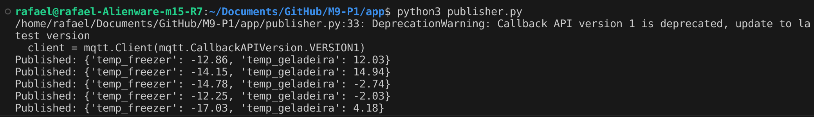
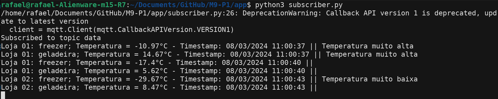

# Simulador de Sensor MQTT

Este é um simulador de sensor MQTT que simula leituras aleatórias de temperatura em mercados e as publica em um tópico MQTT.

## Instalação

### 1. **Clonar o Repositório:**
   ```bash
   git clone https://github.com/rafaelkatalan/Ponderadas-M9/tree/master/P1
   ```
   Vá até o repositorio no terminal.

### 2. **Instalar Dependências:**

   ```bash
   pip install paho-mqtt
   ```
   ```bash
   sudo apt-get install mosquitto mosquitto-clients
   ```
   
## Uso

Dentro da pasta 'app':

### 1. **Configurar o Broker MQTT:**


   ```bash
   mosquitto -c mosquitto.conf
   ```

### 2. **Executar o Simulador:**

**Publisher**:

   ```bash
   python3 publisher.py
   ```
**Subscriber**:

Em um outro terminal:

   ```bash
   python3 subscriber.py
   ```

   O simulador do Publisher começará a gerar leituras aleatórias e as publicará no tópico MQTT especificado.Enquanto isso o subscriber fará a leitura dos dados publicados e alertar caso a temperatura estaja fora do intervalo esperado.

## Imagens Demonstrativas



